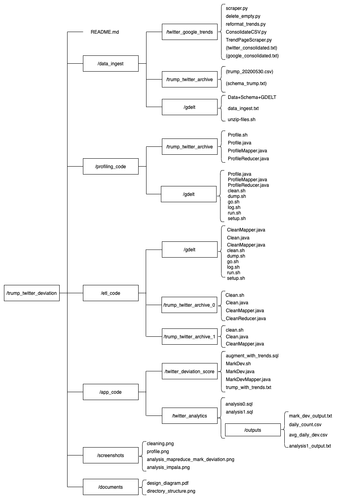

# Trump Twitter Deviation Analysis

## Project Description
This project attempts to identify a pattern of President Trump's tweets where he deviates from current major events such as the COVID-19 pandemic, the Black Lives Matter Movement, etc. We plan to compare topics of Trump's tweets to major news events as well as twitter trends at the time. Our aim is to analyze how the subjects he chooses to focus on deviates from current events. We will also create visualizations to demonstrate how frequently the content of his tweets deviates from the focus of mainstream media and other twitter users. 

## Directory Structure



## Running

### Trend Scraping

1. Navigate to ```/data_ingest/twitter_google_trends```
2. Excecute the following to crawl Twitter trends and Google trends (This may take a while)
```
python scraper.py
```
A new directory named ```trends_data``` should be created
3. Excecute the following to remove empty files in the crawled data
```
python delete_empty.py ./trends_data/google
python delete_empty.py ./trends_data/twitter
```
4. Excecute the following to consolidate the crawled data into one single file 
(one for twitter and another for google).
Please make sure ```trends_data``` stays in the same directory as ```reformat_trends.py```.
```
python reformat_trends.py
```
5. The output files of step 4, ```twitter_consolidated.txt``` and ```google_consolidated.txt``` are placed in the current directory. ```twitter_consolidated.txt``` is used as one of the data sources for this project. 
We refer to ```twitter_consolidated.txt``` as "TWITTER_TRENDS" in this document for convenience.

### Trump Twitter Archive

This dataset is available for download in cleaned csv format (```/data_injest/trump_twitter_archive/trump_20200530.csv```). The file size is small enough that it can be transported using the ```scp``` command. 

In the same directory, ```schema_trump.txt``` describes the dataset. 

Please move this file to HDFS using the ```hdfs dfs -put``` command. We refer to this file as "TRUMP_COMPLETE" and the path to this file as "/path/to/TRUMP_COMPLETE" in this document for convenience. 

### Profiling

1. Navigate to ```profiling_code```. There should be 4 files in the directory, ```Profile.java Profile.sh ProfileMapper.java ProfileReducer.java```. 
2. Open ```Profile.sh``` in your favorite editor. change the output directory of the ```hdfs dfs -mkdir``` command to desired destination (line 10). 
3. Change the destination of the ```hdfs dfs -put``` command to desired location (line 11). Please also make sure the input directory (path to ```trump_20200530.csv```) is correct. 
4. Modify the input and output arguments in line 13 (```hadoop jar Profile.jar ...```) according to previous steps. 
5. Execute the bash script
```
./Profile.sh
```
6. The output should be in the output directory specified in step 4 (line 13)

### Data Cleaning 0

1. Navigate to ```/etl_code/trump_clean0/```. There should be 4 files in the directory, ```Clean.java Clean.sh CleanMapper.java CleanReducer.java```
2. Make the same modifications to ```Clean.sh``` as the ones made to ```Profile.sh``` in the previous section. 
3. Execute the bash script
```
./Clean.sh
```
6. The output should be in the output directory specified in step 2 (line 13)
7. Note: This MapReduce program consolidate all the tweet data on a day into one line. it was later decided the output of this cleaning process would not be used in the analytics.

### Data Cleaning 1

1. Navigate to ```/etl_code/trump_clean1/```. There should be 3 files in the directory, ```Clean.java Clean.sh CleanMapper.java```
2. Follow the same procedure in the previous section - "Data Cleaning 0" to execute this MapReduce job
3. The output file has the format "tweet_id  data  keywords" that contains the keywords of each tweet. 
4. We refer to the output of this job as "TRUMP_KEYWORDS" for convenience.

### Calculate Deviation

1. Move "TWITTER_TRENDS" and "TRUMP_KEYWORDS" to HDFS using the ```hdfs dfs -put``` command. We refer to the paths to these files as "/path/to/TWITTER_TRENDS" abd "/path/to/TRUMP_KEYWORDS" for convenience.
2. Navitage to ```/app_code/twitter_deviation_score```. There should be a file named "augment_with_trends.sql".
3. Change the path in line 5 to "/path/to/TRUMP_KEYWORDS", the path in line 13 to "/path/to/TWITTER_TRENDS", and the path in line 26 to "/path/to/TRUMP_COMPLETE". 
4. Start Impala shell with command 
```
impala-shell -B -o trump_with_trends.txt --output_delimiter=';'
```
so that the output of the query in line 24 is written to ```trump_with_trends.txt```.
5. Move ```trump_with_trends.txt``` to HDFS using the ```hdfs dfs -put``` command. 
6. Modify ```MarkDev.sh``` in this directory so that on line 9 the input file to he MapReduce job is ```trump_with_trends.txt``` and it outputs to desired location. We refer to the output as "mark_dev_output.txt". 
7. "mark_dev_output.txt" has the format "tweet_id  date  deviate_mark". If a tweet is determined to deviate from twitter trends, deviate_mark is set to 1. Otherwise it is set to 0.

### Analysis

1. Navigate to ```/app_code/twitter_analytics```.
2. Modify the input location in ```analysis0``` so that it uses the correct path to "mark_dev_output.txt" in line 6 and that ```use zw1400;``` is changed to the correct database name.
3. Execute ```analysis0``` and ```analysis1``` using the command
```
impala-shell -i compute-1-1 -f ./analysis0.sql -B -o analysis0.txt
impala-shell -i compute-1-1 -f ./analysis1.sql -B -o analysis1.txt
```
4. The table information is included either in comment in the .sql files or in the printed messages. 
5. The results are included in ```/app_code/twitter_analytics/outputs```.


